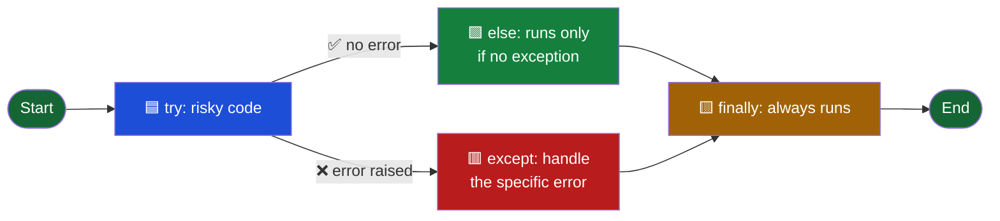
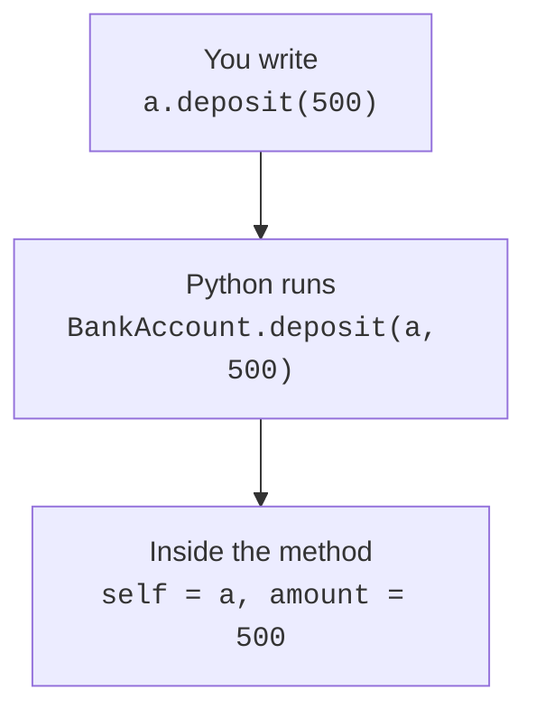

# 🐍 Python Practice Code

<p align="left">
  
  
  
  
  
</p>

A collection of Python practice scripts covering core language concepts — from strings, files, and data with pandas, to lists, tuples, dictionaries, sets, control flow, functions, exception handling, and OOP. Each topic is broken into small, focused files to make it easy to study individual concepts.

---

## 🗺️ Quick Glance (Pictorial Overview)

```mermaid
flowchart TD
    A(["🐍 python-code"]) --> B["📝 Strings & Basics"]
    A --> C["📖 Dictionary/"]
    A --> D["📋 list_tuple/"]
    A --> E["🔗 set/"]
    A --> F["🏛️ class/ (OOP)"]
    A --> G["⚙️ fundaments_programming/"]
    A --> H["📊 data/ (Files & Pandas)"]

    B --> B1["raw_string.py"]
    B --> B2["string_format.py"]
    B --> B3["test.py (if/elif/else)"]

    C --> C1["dict_data.py"]
    C --> C2["practice_dict.py (keys/values/del)"]
    C --> C3["practice_set.py (set ops)"]

    D --> D1["List methods: append, insert,
    extend, pop, remove, sort, slice..."]
    D --> D2["Tuple methods: index, slice,
    count, sum/min/max/len"]
    D --> D3["playlist.py (nested tuple/list)"]

    E --> E1["set.py (union | intersection & update)"]
    E --> E2["searching_in_set.py (in)"]

    F --> F1["rectangle_class.py (attributes)"]
    F --> F2["circle_class.py + main.py
    (methods, matplotlib draw)"]
    F --> F3["Points.py (multiple objects,
    enumerate, scope)"]

    G --> G1["Loops: for, while,
    break/continue, enumerate"]
    G --> G2["functions.py (def, return,
    scope, sorted)"]
    G --> G3["exception_handling*.py
    (try/except/else/finally)"]
    G --> G4["TextAnalyzer class
    (word frequency)"]

    H --> H1["files.py (read/write/append modes)"]
    H --> H2["pandas_practice.py (DataFrame, Series,
    read_csv, read_excel, loc/iloc)"]
    H --> H3[("mycsv.csv /
    Count_Candidate.xlsx")]

    classDef root fill:#4c1d95,color:#fff,stroke:#a78bfa,stroke-width:2px;
    classDef topic fill:#1e3a8a,color:#fff,stroke:#60a5fa,stroke-width:2px;
    classDef leaf fill:#0f766e,color:#fff,stroke:#2dd4bf,stroke-width:1px;
    classDef data fill:#9a3412,color:#fff,stroke:#fb923c,stroke-width:1px;

    class A root;
    class B,C,D,E,F,G,H topic;
    class B1,B2,B3,C1,C2,C3,D1,D2,D3,E1,E2,F1,F2,F3,G1,G2,G3,G4 leaf;
    class H1,H2,H3 data;
```



---

## 🌊 Exception Handling Flow



---

## 📁 Project Structure

```
python-code/
├── raw_string.py          # Raw strings and escape characters
├── string_format.py       # String formatting techniques
├── test.py                # Basic if/elif/else conditionals
├── file.txt               # Sample text file
│
├── Dictionary/
│   ├── dict_data.py       # Dictionary data definitions (shared data)
│   ├── practice_dict.py   # Dictionary operations and methods
│   └── practice_set.py    # Set operations and methods
│
├── list_tuple/
│   ├── test_data.py               # Shared test data for list/tuple scripts
│   ├── list.py                    # List basics and comparison with tuples
│   ├── list_append.py             # append() method
│   ├── list_copy.py               # copy() — shallow copy of a list
│   ├── list_method.py             # count() method
│   ├── insert_method.py           # insert() method
│   ├── extend_method.py           # extend() method
│   ├── pop_method.py              # pop() method
│   ├── remove_method.py           # remove() method
│   ├── del_method.py              # del statement
│   ├── delete_from_list.py        # Deleting elements + split()
│   ├── sort.py                    # sort() — ascending and descending
│   ├── slice.py                   # List slicing syntax
│   ├── reverse_method.py          # reverse() method
│   ├── clone_list_syntax.py       # Reference copy vs. clone ([:])
│   ├── use_split_as_delimiter.py  # split() with a delimiter
│   ├── playlist.py                # Nested tuple/list indexing
│   ├── tuple.py                   # Tuple basics, indexing, slicing
│   ├── nested_tuple.py            # Nested tuples and access
│   ├── tuple_count.py             # count() on tuples
│   └── tuple_sum_min_max_len.py   # sum(), min(), max(), len() on tuples
│
├── set/
│   ├── set.py                     # Set creation, union, intersection, update
│   └── searching_in_set.py        # Membership testing with `in`
│
├── class/
│   ├── rectangle_class.py         # Rectangle class — constructor & attributes
│   ├── circle_class.py            # Circle class — methods + matplotlib drawing
│   ├── main.py                    # Driver script for Circle (instantiate, call methods)
│   └── Points.py                  # Points class, enumerate, variable scope
│
├── fundaments_programming/
│   ├── for_loop.py             # range(), iterating lists
│   ├── for_loop_2.py           # Iterating by index vs. by value, mutating a list
│   ├── enumerated_for_loop.py  # enumerate() for index + value
│   ├── while_loop.py           # while loops with different increments
│   ├── break_continue_loop.py  # break and continue statements
│   ├── functions.py            # def, return values, scope, sorted()
│   ├── addition_of_numbers.py  # Simple function definitions (add variants)
│   ├── exception_handling.py   # try/except/else/finally with file I/O
│   ├── exception_handling_2.py # try/except for ZeroDivisionError, NameError, IndexError, ValueError
│   ├── test_analyzer.py        # TextAnalyzer class — cleans text & builds word-frequency map
│   └── text_analysis.py        # Driver script using TextAnalyzer + if/else, while
│
└── data/
    ├── files.py               # File I/O — read/write/append modes, seek(), truncate()
    ├── pandas_practice.py     # pandas — Series, DataFrame, read_csv/read_excel, loc/iloc
    ├── example1.txt           # Sample text file used by files.py
    ├── mycsv.csv              # Sample CSV used by pandas_practice.py
    └── Count_Candidate.xlsx   # Sample Excel workbook used by pandas_practice.py
```

---

## 📚 Topics Covered

### 📝 Strings (root level)

| File | Concept |
|---|---|
| `raw_string.py` | Escape sequences, raw strings with `r""`, and quoting characters |
| `string_format.py` | Three formatting styles: f-strings, `.format()`, and `%` operator |
| `test.py` | `if / elif / else` conditionals |

---

### 📖 Dictionary (`Dictionary/`)

| File | Concept |
|---|---|
| `dict_data.py` | Defines reusable dictionaries with mixed key/value types |
| `practice_dict.py` | Accessing values by key, `.keys()`, `.values()`, `del()` |
| `practice_set.py` | Creating sets, `.add()`, `.remove()`, set operations: `&`, `.difference()`, `.intersection()`, `.union()`, `.issubset()`, `.issuperset()` |

---

### 📋 Lists & Tuples (`list_tuple/`)

#### List Methods

| File | Method / Concept |
|---|---|
| `list.py` | List vs tuple — mutability, concatenation, slicing, `extend()`, `append()` |
| `list_append.py` | `append()` — adds a single element to the end |
| `list_copy.py` | `copy()` — creates a shallow copy |
| `list_method.py` | `count()` — counts occurrences of an element |
| `insert_method.py` | `insert(index, element)` — inserts at a position |
| `extend_method.py` | `extend(iterable)` — adds multiple elements |
| `pop_method.py` | `pop(index)` — removes and returns element at index |
| `remove_method.py` | `remove(value)` — removes first occurrence of a value |
| `del_method.py` | `del list[index]` — removes element by index |
| `delete_from_list.py` | `del()` with `split()` to create lists from strings |
| `sort.py` | `sort()` ascending; `sort(reverse=True)` descending |
| `slice.py` | Slicing syntax: `[start:stop]`, `[:stop]`, `[start:]` |
| `reverse_method.py` | `reverse()` — reverses a list in place |
| `clone_list_syntax.py` | Reference copy (`B = A`) vs. true clone (`B = A[:]`) |
| `use_split_as_delimiter.py` | `split(",")` — splitting a string into a list using a delimiter |
| `playlist.py` | Indexing into a nested structure of tuples and lists |

#### Tuple Methods

| File | Method / Concept |
|---|---|
| `tuple.py` | Tuple creation, indexing, negative indexing, slicing, concatenation |
| `nested_tuple.py` | Nested tuples and accessing inner elements |
| `tuple_count.py` | `count()` — counts occurrences in a tuple |
| `tuple_sum_min_max_len.py` | `sum()`, `min()`, `max()`, `len()` on numeric tuples |

---

### 🔗 Sets (`set/`)

| File | Concept |
|---|---|
| `set.py` | Set creation, `.union()` / `\|`, `.intersection()` / `&`, `.update()` (note: `+` is not supported on sets) |
| `searching_in_set.py` | Membership testing with the `in` operator |

---

### 🏛️ Object-Oriented Programming (`class/`)

| File | Concept |
|---|---|
| `rectangle_class.py` | Defining a class with `__init__` and storing attributes (`color`, `height`, `width`) |
| `circle_class.py` | A class with instance methods (`add_radius()`, `draw_circle()`) and a `matplotlib`-based visualization |
| `main.py` | Driver script — creates a `Circle`, reads/updates attributes, calls methods, inspects with `dir()` / `type()` |
| `Points.py` | Multiple class instances, mutating an instance attribute, `enumerate(..., start=1)`, and local vs. global variable scope |

---

### ⚙️ Fundamentals of Programming (`fundaments_programming/`)

| File | Concept |
|---|---|
| `for_loop.py` | `range()` variants, iterating over lists |
| `for_loop_2.py` | Iterating by index vs. by value; mutating list elements during iteration |
| `enumerated_for_loop.py` | `enumerate()` to get index + value together |
| `while_loop.py` | `while` loops with different step increments |
| `break_continue_loop.py` | `break` to exit a loop early, `continue` to skip an iteration |
| `functions.py` | Function definitions, `return`, variable scope (local vs. global), `sorted()` |
| `addition_of_numbers.py` | Simple function variants for adding two numbers |
| `exception_handling.py` | `try / except / else / finally` with file I/O (`IOError`) |
| `exception_handling_2.py` | Handling `ZeroDivisionError`, `NameError`, `IndexError`, `ValueError` |
| `test_analyzer.py` | `TextAnalyzer` class — normalizes text (lowercase, strips punctuation) and builds a word-frequency map |
| `text_analysis.py` | Driver script for `TextAnalyzer`; also covers `if/else` and `while` on simple state |

---

### 📊 Files & Data with Pandas (`data/`)

| File | Concept |
|---|---|
| `files.py` | Opening files in `r`, `w`, `a+`, and `r+` modes; `readline()`, `readlines()`, `write()`, `writelines()`, `seek()`, `truncate()` |
| `pandas_practice.py` | Reading CSV/Excel with `read_csv()` / `read_excel()`, building a `Series` from a list, casting a `dict` to a `DataFrame`, selecting with `.loc[]` / `.iloc[]` |

---

## 🔑 Key Concepts at a Glance

| Concept | Summary |
|---|---|
| 🧱 **Lists** | Mutable — elements can be changed after creation |
| 🔒 **Tuples** | Immutable — once created, elements cannot be reassigned |
| 🔗 **Sets** | Automatically remove duplicates; support `union`, `intersection`, `update` — but not `+` |
| 📖 **Dictionaries** | Store key–value pairs; keys can be strings, numbers, or tuples |
| 🔤 **Raw strings** | `r"..."` treats backslashes literally — useful for file paths |
| 📋 **Cloning a list** | `[:]` creates an independent copy; `=` only copies the reference |
| 🏛️ **Classes** | Bundle state (`__init__` attributes) with behavior (methods); each instance keeps its own copy |
| 🌊 **Exception handling** | `try → except → else → finally`: `else` runs only if no exception occurred, `finally` always runs |
| 🔢 **`enumerate()`** | Gives both index and value while looping, optionally starting from a custom number |
| 📊 **pandas DataFrame** | Tabular structure built from dicts, CSVs, or Excel files; sliced with `.loc[]` (labels) and `.iloc[]` (positions) |

---

## ✅ Prerequisites

- Python 3.x
- `matplotlib` (only needed for `class/circle_class.py`, which draws a circle) — install with `pip install matplotlib`
- `pandas` and `openpyxl` (needed for `data/pandas_practice.py`, which reads CSV/Excel files) — install with `pip install pandas openpyxl`

All other scripts use only the Python standard library.

---

## ▶️ Running the Scripts

Run any script directly from the terminal:

```bash
python raw_string.py
python string_format.py
python Dictionary/practice_dict.py
python list_tuple/sort.py
python set/set.py
python class/main.py
python fundaments_programming/for_loop.py
python data/pandas_practice.py
```

> Some scripts import shared data/classes from sibling files (e.g. `list_tuple/test_data.py`, `class/circle_class.py`, `fundaments_programming/test_analyzer.py`) or read relative file paths (e.g. `data/pandas_practice.py`, `data/files.py`), so run them from the repository root or adjust the path accordingly.

## What Python does with the dot


