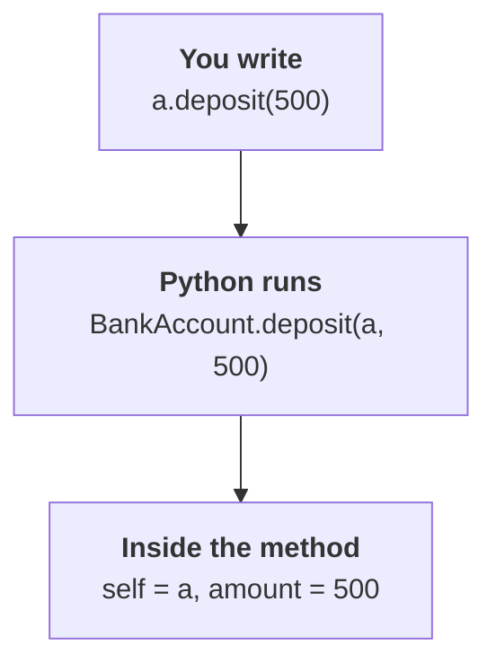

# Understanding `self` in Python

Notes on why every Python method takes `self` as its first parameter, and what it
actually does.

## Start here: a class with actual data

A test class is a bad place to learn `self`, because it holds no data — `self`
looks like pointless ceremony. Use a class where it obviously matters.

```python
class BankAccount:
    def __init__(self, owner, balance):
        self.owner = owner
        self.balance = balance

    def deposit(self, amount):
        self.balance = self.balance + amount

    def show(self):
        print(self.owner, "has", self.balance)
```

Now make two of them:

```python
a = BankAccount("Manoj", 1000)
b = BankAccount("Ravi", 5000)

a.deposit(500)

a.show()    # Manoj has 1500
b.show()    # Ravi has 5000
```

`deposit` is **one function**, but there are **two accounts**. When you call
`a.deposit(500)`, how does that one function know it should change `a`'s balance
and not `b`'s?

Because Python passes `a` into it. That's `self`.

> `self` = the particular object this method was called on.

In `a.deposit(500)`, `self` is `a`. In `b.deposit(500)`, `self` is `b`. Same
code, different object each time.

## What Python actually does with the dot



The single most confusing thing for beginners is right here:

```python
def deposit(self, amount):   # two parameters
a.deposit(500)               # one argument
```

That looks wrong until you accept: **whatever is left of the dot silently
becomes the first argument.** The counts do match — you just can't see one of
them.

## Back to the test file

```python
def test_square(self):
    self.assertEqual(square(15), 225)
```

Two questions answer themselves.

**Where does `assertEqual` come from?** Not from your class — you never wrote
it. It comes from `unittest.TestCase`, which you inherited. `self` is the handle
that reaches up into the parent class to find it. Without `self.`, Python would
look for a plain local function named `assertEqual`, find nothing, and raise
`NameError`.

**Which object is `self` here?** `unittest` builds an instance of
`TestMyModule` for each test method and calls it. You never see that code, which
is exactly why `self` feels like it appeared from nowhere. It is roughly doing:

```python
t1 = TestMyModule('test_square')
t1.test_square()                    # self = t1

t2 = TestMyModule('test_doubler')
t2.test_doubler()                   # self = t2
```

Two separate objects. That is how one test cannot corrupt another's state.

## The one-line version

> `self` is the object you called the method on. Python passes it in
> automatically as the first argument, and it is the only way to reach that
> object's data and its inherited methods.

## Prove it to yourself

Run this — seeing the ids print differently is what makes it click:

```python
class Demo:
    def who_am_i(self):
        print("self is:", self, "id:", id(self))


x = Demo()
y = Demo()

x.who_am_i()          # prints x's id
y.who_am_i()          # prints y's id

Demo.who_am_i(x)      # same as x.who_am_i() — passing self manually
```

That last line is the whole concept in one statement.

## Notes

- `self` is not a keyword. It is an ordinary parameter name, and the convention
  is universal — do not rename it.
- Forgetting `self` in the signature gives
  `TypeError: method() takes 0 positional arguments but 1 was given`. Read that
  as: Python passed the instance and your function had nowhere to put it.
- `@staticmethod` takes no `self` (closest to Java's `static`). `@classmethod`
  receives the class as `cls` instead of the instance.
